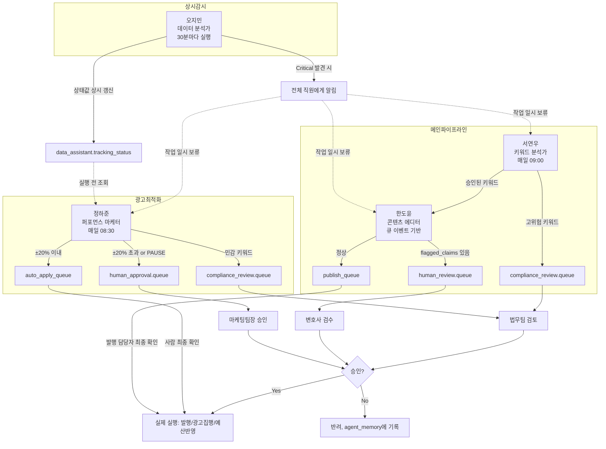

# Hermes AI 전체 시스템 흐름

이 문서는 서연우/한도윤/정하준/오지민 4명이 개별적으로 무엇을 하는지가 아니라,
**4명이 하나의 시스템으로 어떻게 맞물려 돌아가는지**를 설명합니다.
개별 직원의 상세 판단 기준은 각 직원 폴더의 SOUL.md/config.md/routine.yaml을 참고하세요.

## 1. 전체 흐름 (다이어그램)



## 2. 핵심 원칙: 판단과 실행의 분리

이 시스템 전체를 관통하는 원칙은 하나입니다.

> **AI 4명 중 누구도 스스로 "실행"하지 않는다. 모든 실행은 사람의 최종 확인을 거친다.**

| 직원   | 자율적으로 하는 것                                 | 반드시 사람을 거치는 것                            |
| ------ | -------------------------------------------------- | -------------------------------------------------- |
| 서연우 | 키워드 발굴, urgency/compliance 판정               | 고위험 키워드는 애초에 다음 단계로 자동 진행 안 됨 |
| 한도윤 | 콘텐츠 초안 작성, 자기 확신도 표시(flagged_claims) | 최종 컴플라이언스 판정, 실제 발행                  |
| 정하준 | 입찰/예산 조정안 생성                              | ±20% 초과 조정, PAUSE, 실제 반영                   |
| 오지민 | 이상탐지, 알림 발송                                | (실행 행위 자체가 없음 — 감시·알림 전용)           |

## 3. Handoff 순서 (정상 경로)

```
서연우 (매일 09:00)
   │ 신규 키워드 발굴 + 판정
   ▼
한도윤 (키워드 큐 감지 시 즉시)
   │ 콘텐츠 초안 작성
   ▼
[사람 검수 여부 분기]
   │
   ├─ flagged_claims 없음 → publish_queue → 발행 담당자 최종 확인 → 발행
   └─ flagged_claims 있음 → human_review.queue → 변호사 검수 → 승인 시 발행
```

정하준과 오지민은 이 메인 파이프라인과 **병렬로** 돌아갑니다. 정하준은 콘텐츠와 무관하게 매일 광고 성과를 검토하고, 오지민은 항상 상시로 트래킹을 감시합니다.

## 4. 예외 경로 (에스컬레이션)

### 4-1. 고위험 키워드 발견 시 (서연우 → 법무팀)

```
서연우가 compliance_risk=high 판정
   → compliance_review.queue 등록
   → content_editor로 자동 전달되지 않음 (핸드오프 중단)
   → 법무팀 검토 후에만 다음 단계 진행 가능
```

### 4-2. 트래킹 이상 발견 시 (오지민 → 전체)

```
오지민이 status_summary=Critical 판정
   → broadcast.all_agents (서연우/한도윤/정하준 전체 수신)
   → 수신 측은 해당 데이터 기반 작업을 일시 보류하거나 caution_flag를 달고 진행
   → 동시에 dev_team.queue에 등록되어 개발팀이 원인 조사
```

이 경로가 중요한 이유: 트래킹이 고장 나 있으면 정하준의 입찰 조정이 잘못된 데이터 위에서 이루어질 수 있기 때문입니다. 오지민은 다른 3명과 달리 **상시(30분 주기)**로 돌아가는 이유가 여기에 있습니다.

### 4-3. 큰 폭 광고 조정 (정하준 → 마케팅팀장)

```
정하준이 ±20% 초과 조정 또는 PAUSE 제안
   → human_approval.queue
   → 마케팅팀장 승인 후에만 실행
```

### 4-4. 반복 문제 패턴 발견 시

| 상황                                            | 대상              | 의미                              |
| ----------------------------------------------- | ----------------- | --------------------------------- |
| 동일 flagged_claims 사유 5회 이상 반복 (한도윤) | 법무팀            | knowledge base 갱신 필요 신호     |
| 반려율 30% 초과 (한도윤)                        | 마케팅팀장        | 프롬프트/knowledge 전반 점검 필요 |
| 동일 캠페인 반려 3회 연속 (정하준)              | 마케팅팀장        | 전략 재검토 필요                  |
| compliance_risk=high 1일 3건 이상 (서연우)      | 마케팅팀장+법무팀 | 타겟팅 방향 재검토 필요           |

## 5. 큐/상태값 전체 목록

> 상세 정의는 `_shared/queues.md` (예정)에서 관리. 여기서는 흐름 이해를 위한 요약만 제공.

| 큐/상태값 이름                   | 쓰는 직원              | 읽는 주체                    |
| -------------------------------- | ---------------------- | ---------------------------- |
| `content_editor.inbox`           | 서연우                 | 한도윤                       |
| `compliance_review.queue`        | 서연우, 정하준         | 법무팀 (사람)                |
| `human_review.queue`             | 한도윤                 | 변호사 (사람)                |
| `publish_queue`                  | 한도윤                 | 발행 담당자 (사람)           |
| `auto_apply_queue`               | 정하준                 | 마케팅팀 (최종 확인 후 반영) |
| `human_approval.queue`           | 정하준                 | 마케팅팀장 (사람)            |
| `data_assistant.tracking_status` | 오지민                 | 정하준 (매 실행 전 조회)     |
| `broadcast.all_agents`           | 오지민                 | 서연우, 한도윤, 정하준       |
| `dev_team.queue`                 | 서연우, 한도윤, 오지민 | 개발팀 (사람)                |
| `agent_memory`                   | 전원                   | 전원 (자기 이력 조회용)      |
| `audit_log`                      | 전원                   | 사람 (감사 시 조회)          |

## 6. 이 문서가 바뀌어야 할 때

- 새로운 직원(5번째 이상)이 추가될 때
- 핸드오프 경로가 변경될 때 (예: 승인 임계치 변경, 새로운 큐 추가)
- 에스컬레이션 대상/채널이 조직 개편으로 바뀔 때
